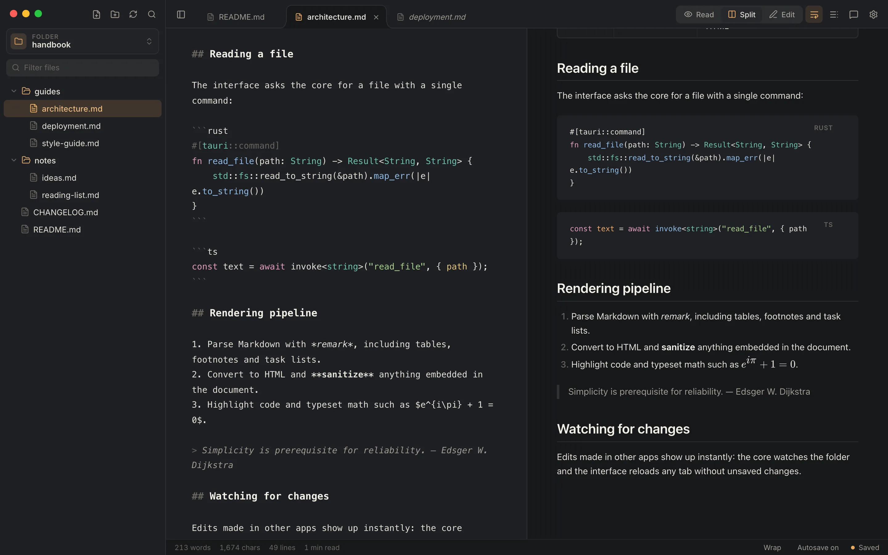

<p align="center">
  
</p>

<h1 align="center">Mido</h1>

<p align="center">
  <strong>A quiet place to read and write Markdown.</strong><br />
  A Markdown viewer and editor for macOS, built with Tauri, Rust and React.
</p>

<p align="center">
  <a href="https://serafo27.github.io/mido/">Website</a> ·
  <a href="https://github.com/serafo27/mido/releases/latest">Download</a> ·
  <a href="https://serafo27.github.io/mido/changelog.html">Changelog</a> ·
  <a href="#features">Features</a> ·
  <a href="#development">Development</a> ·
  <a href="#license">License</a>
</p>



## Download

Get the latest installer from the [releases page](https://github.com/serafo27/mido/releases/latest) or the [website](https://serafo27.github.io/mido/#download):

| Platform | Package |
| --- | --- |
| macOS | `.dmg` for Apple Silicon and Intel |

Windows and Linux builds are planned but not published yet.

Just want to read? [Mido for the web](https://serafo27.github.io/mido/app/) opens folders and Markdown files from your computer right in the browser, read-only. Nothing is uploaded: the files are read in the browser and never leave your computer. Chrome, Edge and other Chromium browsers can reopen recent folders and pick up changes made on disk; Safari and Firefox read a folder as it is when you open it.

Mido isn't code-signed yet: the first time, right-click the app and choose **Open**, or allow it in **System Settings → Privacy & Security** (or run `xattr -cr /Applications/Mido.app`). Updates install from inside the app and don't ask again.

## Privacy

Your documents stay on your computer: Mido never uploads files, their names, paths or contents. To learn how many people use it and which features matter, the desktop app and the web version send anonymous usage statistics to [PostHog](https://posthog.com) (EU servers), at most once a day: that Mido was used, its version, platform and processor, the theme, and whether git and the terminal were used, under a random id that identifies nobody. IP addresses aren't stored. Turn it off in **Settings → Privacy**. With **Mido Pro**, the assistant is Claude Code on your Mac: what it reads goes to Anthropic under your own Claude account and its terms, only when you ask it something, and only from the scope you pick. The license check sends Polar your license key, the Mac's name (to list it in your purchases) and Mido's version. The website counts page views and download clicks the same way, without cookies.

## Features

- **Folder sidebar** — a tree of the Markdown files in any folder, with a name filter, create / rename / move to trash from the context menu, and live refresh when files change on disk.
- **Open from anywhere** — double-click a Markdown file in the Finder, use **Open With → Mido**, or drop it on the Dock icon: Mido opens its folder and the file in a tab. From the terminal, `open -a Mido notes.md` (or a folder); add `alias mido="open -a Mido"` to your shell profile to type `mido notes.md`.
- **Quick search** (`⌘P`) — a Spotlight-style panel that finds files by name (fuzzy: `rdm` finds `README.md`) and every line containing the text you type. Choose with the arrow keys and press Return to open the file at that line.
- **Search in files** (`⌘⇧F`) — search the text of every Markdown file in the folder, with match-case and whole-word options. Results are grouped by file; click one to jump to its line.
- **Three modes** — Read (`⌘1`), Split with synced scrolling and a resizable divider (`⌘2`), and Edit (`⌘3`).
- **Rendering** — GitHub Flavored Markdown (tables, task lists, footnotes, strikethrough), GitHub-style alerts, KaTeX math, Mermaid diagrams (` ```mermaid ` blocks, following light and dark themes), syntax highlighting, frontmatter shown as a card, sanitized HTML, relative images, and relative `.md` links that open inside Mido.
- **Minimap** — optionally, a VS Code-style minimap in place of the scrollbar (**Settings → Reading**): the text in small in the editor, a miniature of the page in the preview. Click to jump or drag to scroll.
- **Wrap or scroll** (`⌥Z`) — wrap everything to the window, or keep code blocks and tables intact and scroll sideways. Applies to the editor too.
- **Tabs** — a single click opens a file in a *preview* tab (italic) that the next single click replaces; double-click a file or tab to keep it open, and editing a file keeps it open automatically. When there are more tabs than fit, arrows either side scroll through them. Drag to reorder, middle-click or `⌘W` to close, `⌘⇧[` / `⌘⇧]` or `Ctrl+Tab` to switch. Each tab keeps its own undo history, selection and scroll position, and open tabs are restored on launch. Choose classic square tabs or rounded, folder-like ones in **Settings → Appearance**.
- **Comments** — select text in the editor or the preview and click **Comment** over it (or press `⌥⌘M`). The Comments panel (`⌘⇧M`) lists the threads in document order, with replies, resolve and reopen. Commented text gets a light dotted underline that shows the thread on hover, and ticks beside the scrollbar mark where the comments are. Comments are signed with your git user (`git config user.name`) and saved in a hidden `.mido/comments` folder inside the open folder, so committing and pushing it shares them with everyone working on the repository. Each comment is its own file, so branches merge without conflicts; resolving a thread gathers it into a single file.
- **Outline** (`⌘⇧O`) — a panel listing the document's headings. Click to jump to a section; the current section is highlighted as you scroll.
- **Editor** — CodeMirror 6 with Markdown and code-block highlighting, `⌘B` / `⌘I` / `⌘K` for bold, italic and links, and `⌘F` to search. Paste an image (`⌘V`, e.g. a screenshot) or drop image files into the editor: they're saved in an `assets` folder next to the document and linked where you paste or drop them.
- **Terminal** (`⌃``) — your login shell under the document, in the open folder, as in VS Code: several terminals in tabs (`⌃⇧``), each closed with its **×**, coloured by the theme and drawn on the GPU. It uses the system's monospaced font, or any installed one (**Settings → Terminal**).
- **Reading styles** — Mido, GitHub, VS Code, Obsidian, Notion, Academic and Minimal presets, plus separate fonts for body, headings and code (bundled, system, or any installed font), text size, line height, page width, justified text and frontmatter visibility.
- **Themes** — Auto / Light / Dark mode with a preferred theme for each. Built in: Mido Light & Dark, VS Code Light+ & Dark+, IntelliJ Light & Darcula, GitHub Light, Relax, Relax Night, Solarized Light, Nord and Dracula. Accent colour follows the theme or can be overridden.
- **Custom themes** — duplicate any theme, edit its nineteen colours with live preview, and share it as JSON (see below).
- **Export and print** — **File → Export as HTML…** (`⌘⇧E`) saves a standalone page with the current theme and reading style, images embedded and diagrams included. **File → Print…** (`⌥⌘P`) prints the document on its own in the light theme; choose **Save as PDF** in the print panel for a PDF.
- **Saving** — autosave while you type (can be turned off) or `⌘S`. Mido asks before closing with unsaved changes.
- **File path bar** — shows `folder › … › file` above the tabs; turn it off in settings to move the tabs into the title bar.
- **Assistant (Mido Pro)** (`⌘⇧L`) — chat with [Claude Code](https://claude.com/claude-code), installed on your Mac and signed in to your Claude account, about the documents open in tabs, the folder, or every folder open in Mido. Select text and click **Ask** (`⌥⌘L`) to ask about a passage. It writes notes into an `ai` folder in the project, and asks before changing any other document, showing the change as a diff. Several conversations per folder, with their history; any of them can open in a tab. Mido Pro is a one-time purchase through [Polar](https://polar.sh), activated with a license key per Mac.

## Keyboard shortcuts

| Shortcut | Action |
| --- | --- |
| `⌘O` | Open folder |
| `⌘1` `⌘2` `⌘3` | Read · Split · Edit |
| `⌘S` | Save |
| `⌘⇧E` | Export as HTML |
| `⌥⌘P` | Print (or save as PDF) |
| `⌘W` | Close tab |
| `⌘⇧[` `⌘⇧]` / `Ctrl+Tab` | Previous · next tab |
| `⌘P` | Quick search: files and text |
| `⌘⇧F` | Search in files |
| `⌘⇧O` | Toggle outline |
| `⌘⇧M` | Toggle comments |
| `⌥⌘M` | Comment on the selected text |
| `⌘⇧L` | Toggle the assistant (Mido Pro) |
| `⌥⌘L` | Ask the assistant about the selected text |
| `⌘\` | Toggle sidebar |
| `⌘,` | Settings |
| `⌥Z` | Toggle line wrap |
| `⌘B` `⌘I` `⌘K` | Bold · Italic · Link (`⌥⌘K` in a git repository) |
| `⌃⇧G` | Source control |
| `⌘K` | Commit dialog (in a git repository) |
| `⌘⇧K` | Push dialog (in a git repository) |
| `⌘F` | Find in editor |

## Theme format

Custom themes can be imported and exported as JSON from **Settings → Themes**:

```json
{
  "name": "My theme",
  "kind": "dark",
  "colors": {
    "bg": "#1b1d22", "sidebar": "#22252b", "elevated": "#2a2d34", "border": "#353942",
    "text": "#d9dce3", "muted": "#9aa0ab", "faint": "#636977", "heading": "#f2f4f8",
    "accent": "#ff8a65", "warm": "#f0b36b", "codeBg": "#22252b", "codeFg": "#f29db4",
    "keyword": "#c792ea", "string": "#c3e88d", "number": "#f78c6c", "comment": "#676e7b",
    "function": "#82aaff", "type": "#89ddff", "attr": "#ffcb6b"
  }
}
```

Every colour is optional: missing ones come from Mido Light or Mido Dark, depending on `kind`. Any CSS colour format is accepted.

## Development

Requirements:

- Rust 1.90 or later (`rustup update stable`)
- Node.js 22.12 or later (`nvm use` reads `.nvmrc`) and pnpm
- On Linux, the [Tauri system dependencies](https://tauri.app/start/prerequisites/)

```sh
pnpm install
pnpm tauri dev      # run the app with hot reload
pnpm tauri build    # production bundle (.app / .dmg)
pnpm dev:web        # the read-only web version, in the browser
pnpm build:web      # build it into dist-web/ (the website publishes it at /app/)
```

The web version is the same React app built with `vite.web.config.ts`, which swaps the Tauri modules for the stand-ins in `src/web/`: they read the folders and files opened in the browser in place of the Rust commands. A test checks that every Rust command and Tauri import the app uses has a web counterpart.

Open the `examples/` folder in Mido to try every rendering feature.

### Continuous integration

- **Build** (`.github/workflows/build.yml`) builds the app for macOS (Apple Silicon and Intel) on every push to `main` and on pull requests; the installers are attached to each run as artifacts. Windows and Linux jobs are ready to be re-enabled in the build matrix once tested. To release a version: add its section to [CHANGELOG.md](CHANGELOG.md), set the same version in `src-tauri/tauri.conf.json` and `package.json`, then push a matching tag (for example `git tag v0.2.0 && git push --tags`). The workflow checks that the tag matches the app version, builds the installers, uses the changelog section as the release notes and publishes the release once every build has succeeded. The website's changelog page lists every published release.
- **Website** (`.github/workflows/pages.yml`) publishes the `site/` folder to GitHub Pages whenever it changes.

### Project structure

```
src-tauri/src/lib.rs    Rust commands: file tree, read/write, file operations, folder watcher, macOS menu
src/App.tsx             app state, tabs, shortcuts, layout, scroll sync
src/components/         Sidebar, Toolbar, TabBar, Editor, Preview, Outline, SettingsPanel, ThemeSection, StatusBar, Welcome
src/lib/settings.ts     settings model, font catalogue, reading-style presets
src/lib/themes.ts       built-in themes, CSS variable derivation, JSON import/export
src/lib/outline.ts      heading extraction for the outline
src/lib/markdown.ts     remark/rehype plugins, sanitization schema, frontmatter
src/styles/             app.css (interface and theme tokens), markdown.css (rendering)
site/                   the GitHub Pages website
```

## License

Copyright © 2026 Serafino D'Angelillo. All rights reserved.

Mido is **source-available, not open source**. You're welcome to read the code and to download and use the official installers for free, for personal or commercial purposes. Copying, modifying or redistributing the code or builds — including publishing it in other repositories or websites — requires prior written permission. See [LICENSE](LICENSE) for the full terms.
